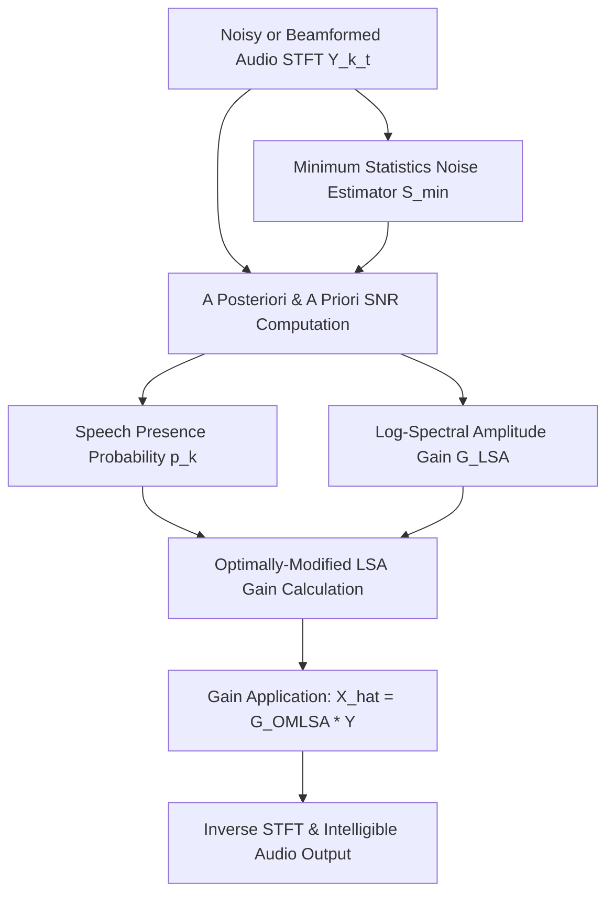

In digital signal processing and speech enhancement, spatial filtering techniques (such as Multi-channel Wiener Filtering or beamforming) effectively attenuate directional noise sources. However, residual non-stationary noise, diffuse background acoustic clutter, and reverberation often linger in the processed audio. 

Applying traditional spectral subtraction or hard noise gate suppression to clean this residual noise causes severe **musical noise artifacts**—random, isolated spectral peaks that destroy human speech intelligibility and sound unnaturally harsh.

In this post, I explore the mathematical formulation and practical implementation of **Optimally-Modified Log-Spectral Amplitude (OM-LSA)** speech enhancement—a single-channel post-filtering technique designed by Israel Cohen and Baruch Berdugo that minimizes log-spectral amplitude estimation errors while preserving natural speech quality.

---

## 1. System Overview & Post-Filtering Pipeline

OM-LSA operates in the Short-Time Fourier Transform (STFT) domain, serving either as a standalone single-channel speech enhancer or as a post-filter downstream from spatial beamformers:



---

## 2. Mathematical Formulation of OM-LSA

For a short-time Fourier frame $t$ and frequency bin $k$, let $Y(k,t) = X(k,t) + D(k,t)$ represent the complex STFT coefficient, where $X(k,t)$ is the clean speech component and $D(k,t)$ is the additive noise.

The power spectral density (PSD) of the noisy signal $P(k,t) = |Y(k,t)|^2$ is smoothed temporal-wise:

$$S(k,t) = \alpha_s \, S(k,t-1) + (1 - \alpha_s) \, |Y(k,t)|^2$$

Where $\alpha_s \in [0.9, 0.95]$ is the smoothing factor.

### Minimum Statistics Noise Power Estimation
Rather than assuming stationary noise or relying on binary Voice Activity Detection (VAD), OM-LSA tracks the **local minimum noise power spectrum** $S_{\text{min}}(k,t)$ over a sliding temporal window of $D$ frames (typically 60–100 frames):

$$S_{\text{min}}(k,t) = \min_{\tau \in [t-D, \, t]} S(k,\tau)$$

The noise variance $\lambda_d(k,t)$ is updated recursively based on speech presence ratios $S(k,t) / S_{\text{min}}(k,t)$:

$$\lambda_d(k,t) = \alpha_d \, \lambda_d(k,t-1) + (1 - \alpha_d) \, |Y(k,t)|^2$$


---

## 3. Log-Spectral Amplitude & Speech Presence Probability

OM-LSA formulates two essential Signal-to-Noise Ratio (SNR) metrics:

1. **A Posteriori SNR ($\gamma_k$)**:
   $$\gamma_k(t) = \frac{|Y(k,t)|^2}{\lambda_d(k,t)}$$

2. **A Priori SNR ($\xi_k$)** (via Decision-Directed Approach):
   $$\xi_k(t) = \alpha_{\text{dd}} \cdot \frac{|\hat{X}(k,t-1)|^2}{\lambda_d(k,t-1)} + (1 - \alpha_{\text{dd}}) \cdot \max\big(\gamma_k(t) - 1, \, 0\big)$$

### Standard LSA Gain Function
The standard Log-Spectral Amplitude estimator minimizes the mean-square error of the log-spectra:

$$G_{\text{LSA}}(\xi_k, \gamma_k) = \frac{\xi_k}{1 + \xi_k} \exp\left(\frac{1}{2} \int_{v_k}^{\infty} \frac{e^{-x}}{x} dx\right) = \frac{\xi_k}{1 + \xi_k} \exp\left(\frac{1}{2} E_1(v_k)\right)$$

Where $v_k = \frac{\xi_k}{1 + \xi_k} \gamma_k$, and $E_1(v)$ is the exponential integral function.

### Conditional Speech Presence Probability ($p_k$)
Under speech presence uncertainty, the conditional probability $p_k(t) = P(H_1(k,t) \mid Y(k,t))$ is calculated as:

$$p_k(t) = \left[ 1 + \frac{1 - q_k}{q_k} (1 + \xi_k) \exp(-v_k) \right]^{-1}$$

Where $q_k$ represents the a priori speech absence probability.

### Optimally-Modified LSA Gain ($G_{\text{OMLSA}}$)
Finally, the OM-LSA suppression gain incorporates $p_k(t)$ and a pre-configured gain floor $G_{\text{min}}$ (e.g. -25 dB):

$$G_{\text{OMLSA}}(k,t) = \left[ G_{\text{LSA}}(\xi_k, \gamma_k) \right]^{p_k(t)} \cdot G_{\text{min}}^{1 - p_k(t)}$$

$$\hat{X}(k,t) = G_{\text{OMLSA}}(k,t) \cdot Y(k,t)$$


---

## 4. Python / NumPy Reference Implementation

Below is a complete Python / NumPy implementation of the OM-LSA post-filtering loop operating across STFT frames:

```python
import numpy as np

def exp1_approx(x):
    """
    Abramowitz & Stegun polynomial approximation of Exponential Integral E1(x).
    Enables fast, native evaluation without scipy overhead.
    """
    x = np.asarray(x, dtype=np.float64)
    x_safe = np.maximum(x, 1e-10)
    
    # Polynomial approximation coefficients for x <= 1
    a = [-0.57721566, 0.99999193, -0.24991055, 0.05519968, -0.00976004, 0.00107857]
    poly = a[5]
    for coef in a[4::-1]:
        poly = poly * x_safe + coef
    e1_small = poly - np.log(x_safe)
    
    # Rational approximation for x > 1
    num = (x_safe + 2.334733) * x_safe + 0.250621
    den = (x_safe + 3.330657) * x_safe + 1.681534
    e1_large = (np.exp(-x_safe) / x_safe) * (num / den)
    
    return np.where(x <= 1.0, e1_small, e1_large)


def omlsa_postfilter(Y_stft, floor_db=-25.0, a_dd=0.92, a_s=0.90, a_d=0.85, win_min=60):
    """
    Applies OM-LSA single-channel speech enhancement over STFT frames Y_stft (F, T).
    
    Parameters:
        Y_stft   : Complex STFT matrix of shape (F_bins, T_frames)
        floor_db : Gain floor in dB (e.g. -25 dB)
        a_dd     : Decision-directed smoothing factor
        a_s      : Power spectral density smoothing factor
        a_d      : Noise estimation recursion factor
        win_min  : Sliding window length for minimum statistics
    """
    F, T = Y_stft.shape
    P = np.abs(Y_stft) ** 2
    Gmin = 10.0 ** (floor_db / 20.0)
    
    # Initialize noise spectrum estimate lambda_d from initial frames
    n_init = min(8, T)
    lam = np.maximum(P[:, :n_init].mean(axis=1), 1e-10)
    S = lam.copy()
    
    buf = np.full((win_min, F), 1e30)
    X_hat = np.zeros_like(Y_stft)
    prev_X_power = np.zeros(F)
    
    for t in range(T):
        p_t = P[:, t]
        
        # 1. Smooth power spectrum
        S = a_s * S + (1.0 - a_s) * p_t
        buf = np.vstack([buf[1:], S[np.newaxis, :]])
        Smin = buf.min(axis=0)
        
        # 2. Estimate speech presence & noise spectrum
        Sr = S / np.maximum(Smin, 1e-12)
        ppres = np.clip((Sr - 1.0) / 8.0, 0.0, 1.0)
        lam = np.maximum(lam + (1.0 - ppres) * (a_d * lam + (1.0 - a_d) * p_t - lam), 1e-12)
        
        # 3. Compute A Posteriori & A Priori SNRs
        gamma = np.maximum(p_t / lam, 1e-10)
        xi = a_dd * (prev_X_power / lam) + (1.0 - a_dd) * np.maximum(gamma - 1.0, 0.0)
        
        # 4. Standard LSA Gain Function
        v = (xi / (1.0 + xi)) * gamma
        e1_val = exp1_approx(v)
        G_lsa = (xi / (1.0 + xi)) * np.exp(0.5 * e1_val)
        
        # 5. Speech Presence Probability p_k
        q = 0.2  # A priori speech absence probability
        p_k = 1.0 / (1.0 + ((1.0 - q) / q) * (1.0 + xi) * np.exp(-v))
        
        # 6. Optimally-Modified LSA Gain & Filter
        G_omlsa = (G_lsa ** p_k) * (Gmin ** (1.0 - p_k))
        X_hat[:, t] = G_omlsa * Y_stft[:, t]
        prev_X_power = np.abs(X_hat[:, t]) ** 2
        
    return X_hat

# Example execution
if __name__ == "__main__":
    F_bins, T_frames = 257, 100
    noisy_stft = np.random.randn(F_bins, T_frames) + 1j * np.random.randn(F_bins, T_frames)
    enhanced_stft = omlsa_postfilter(noisy_stft)
    print("OM-LSA Enhanced STFT output shape:", enhanced_stft.shape)
```

---

## 5. Performance & Open-Source Resources

Integrating OM-LSA as a post-filter yields significant perceptual speech quality gains:

- **Speech Intelligibility**: Improves STOI (Short-Time Objective Intelligibility) scores by removing non-stationary noise floors while preserving consonant transients.
- **Zero Musical Noise**: Smooth gain transition functions eliminate isolated spectral spikes typical of standard spectral subtraction.
- **Low Memory & Computational Footprint**: The minimum statistics tracker and polynomial $E_1(v)$ approximation run efficiently on ARM processors and embedded DSPs.

### Open-Source MATLAB Implementation

- 🧮 **MathWorks MATLAB File Exchange**:  
  The open-source MATLAB implementation of the OM-LSA single-channel speech enhancer is published on MATLAB Central:  
  👉 **[Optimally-Modified Log-Spectral Amplitude (OM-LSA) on MATLAB Central File Exchange](https://uk.mathworks.com/matlabcentral/fileexchange/184071-omlsa?s_tid=prof_contriblnk)**
