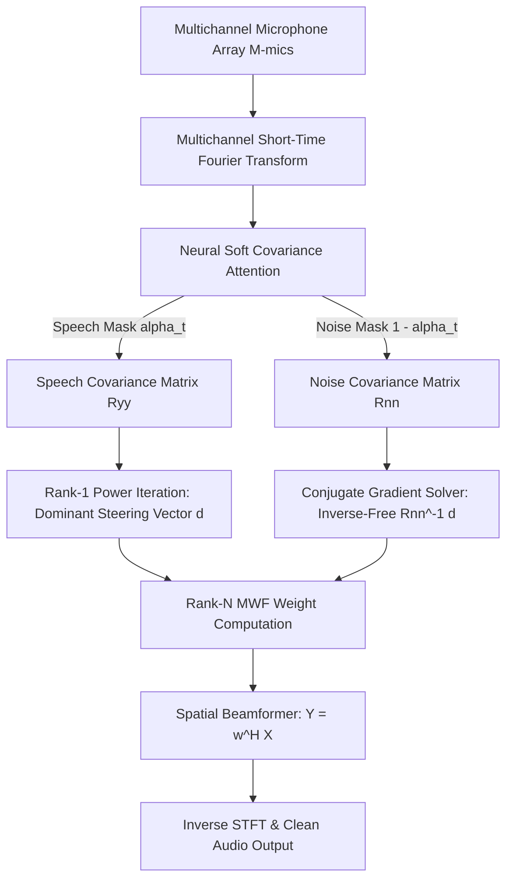

In real-world acoustic engineering—especially on **drones, autonomous robotic platforms, and ultra-low-power edge processors**—speech enhancement poses a severe computational challenge. Environmental wind noise, rotor harmonics, and spatial reverberation degrade microphone signals. 

Traditional Multi-channel Wiener Filters (MWF) offer spatial noise suppression, but computing full matrix inversions $\mathbf{R}_{nn}^{-1}(f)$ at every frequency bin across high sampling rates is computationally prohibitive on low-power microcontrollers (such as ESP32 or STM32).

In this post, I detail our R&D approach behind **Q-WiSE**—a **neural-guided spatial enhancer** that merges **soft neural covariance attention** with an **inverse-free, eigen-free Rank-$N$ update algorithm**.

> ⚡ **Live Interactive Demo**: Try the quantized model in your browser at [sensifai-qwise.hf.space](https://sensifai-qwise.hf.space/).

---

## 1. System Architecture Overview

The pipeline combines a quantized sequence neural network with classical spatial signal processing:



---

## 2. Mathematical Formulation & Soft Covariance Attention

Instead of relying on hard binary Voice Activity Detection (VAD) masks—which introduce harsh musical noise artifacts when thresholding fails—we utilize **soft neural covariance attention**. 

For a frame index $t$ and frequency bin $f$, given the multichannel STFT vector $\mathbf{X}_{f,t} \in \mathbb{C}^M$, a lightweight neural network computes a continuous speech presence score $s_t \in [0, 1]$. We map this to a soft attention weight $\alpha_t$:

$$\alpha_t = \sigma\Big(\kappa \cdot (s_t - \tau)\Big)$$

Where $\sigma(\cdot)$ is the sigmoid activation function, $\tau$ represents the decision threshold, and $\kappa$ controls slope sharpness.

### Spatial Covariance Estimation
Using the soft attention weights, the target speech spatial covariance matrix $\mathbf{R}_{yy}(f)$ and noise spatial covariance matrix $\mathbf{R}_{nn}(f)$ are computed continuously:

$$\mathbf{R}_{yy}(f) = \frac{\sum_t \alpha_t \mathbf{X}_{f,t} \mathbf{X}_{f,t}^H}{\sum_t \alpha_t}$$

$$\mathbf{R}_{nn}(f) = \frac{\sum_t (1 - \alpha_t) \mathbf{X}_{f,t} \mathbf{X}_{f,t}^H}{\sum_t (1 - \alpha_t)}$$

Where $(\cdot)^H$ denotes the Hermitian transpose (complex conjugate transpose).

---

## 3. Inverse-Free Rank-$N$ Matrix Updating

Standard Multi-channel Wiener Filter weights require solving matrix inverses for each frequency bin $f$:

$$\mathbf{w}(f) = \left(\mathbf{R}_{yy}(f) + \mu \mathbf{R}_{nn}(f)\right)^{-1} \mathbf{R}_{yy}(f) \, \mathbf{e}_{\text{ref}}$$

Direct matrix inversion requires $\mathcal{O}(M^3)$ floating-point operations. On an $M$-microphone array across 257 STFT frequency bins at 100 frames/sec, this creates significant latency spikes on ARM Cortex-M or drone flight controllers.

### The Inverse-Free & Eigen-Free Solution
To eliminate matrix inversion $\mathcal{O}(M^3)$ and explicit eigenvalue decomposition:

1. **Power Iteration for Dominant Steering Vector**:
   We compute the acoustic spatial steering vector $\mathbf{d}(f)$ and speech power $\phi_s(f)$ via power iteration directly on $\mathbf{R}_{yy}(f)$, initialized from the reference microphone column:
   $$\mathbf{d}^{(k+1)}(f) = \frac{\mathbf{R}_{yy}(f) \, \mathbf{d}^{(k)}(f)}{\|\mathbf{R}_{yy}(f) \, \mathbf{d}^{(k)}(f)\|}$$

2. **Complex Conjugate Gradient (CG) Solver**:
   Instead of computing $\mathbf{R}_{nn}^{-1}(f)$, we solve the linear system $\mathbf{R}_{nn}(f) \mathbf{x}(f) = \mathbf{d}(f)$ using an iterative **Complex Conjugate Gradient** algorithm in just $K \le M$ steps:
   $$\mathbf{x}(f) = \text{CG-Solve}\Big(\mathbf{R}_{nn}(f) + \epsilon \mathbf{I}, \; \mathbf{d}(f)\Big)$$

3. **Rank-$N$ MWF Weight Vector**:
   The optimal spatial beamforming weights are closed-form calculated as:
   $$\mathbf{w}(f) = \frac{\phi_s(f) \cdot d_{\text{ref}}^*(f) \cdot \mathbf{x}(f)}{\mu + \phi_s(f) \cdot \mathbf{d}(f)^H \mathbf{x}(f)}$$

4. **Spatial Filtering**:
   $$\hat{Y}(f, t) = \mathbf{w}(f)^H \mathbf{X}(f, t)$$

This reduces algorithm complexity from $\mathcal{O}(M^3)$ to $\mathcal{O}(M^2)$, preserving floating-point stability under 32-bit and 16-bit fixed-point quantization.

---

## 4. High-Performance Go Implementation

Below is a simplified Go implementation of the STFT frame processing and Rank-$N$ complex Conjugate Gradient solver:

```go
package main

import (
	"fmt"
	"math/cmplx"
)

// ComplexVector represents an M-channel STFT frame.
type ComplexVector []complex128

// SolveCG performs complex Conjugate Gradient iteration for R_nn * x = d
// avoiding explicit matrix inversion.
func SolveCG(Rnn [][]complex128, d ComplexVector, maxIters int) ComplexVector {
	m := len(d)
	x := make(ComplexVector, m) // Start with zero vector
	r := make(ComplexVector, m)
	copy(r, d)                  // Residual r_0 = d - R_nn * x_0
	p := make(ComplexVector, m)
	copy(p, r)

	rsOld := dotProduct(r, r)

	for iter := 0; iter < maxIters; iter++ {
		if cmplx.Abs(rsOld) < 1e-9 {
			break
		}
		
		// Ap = R_nn * p
		Ap := matVecMul(Rnn, p)
		alpha := rsOld / dotProduct(p, Ap)

		for i := 0; i < m; i++ {
			x[i] += alpha * p[i]
			r[i] -= alpha * Ap[i]
		}

		rsNew := dotProduct(r, r)
		beta := rsNew / rsOld
		for i := 0; i < m; i++ {
			p[i] = r[i] + beta*p[i]
		}
		rsOld = rsNew
	}
	return x
}

func dotProduct(a, b ComplexVector) complex128 {
	var sum complex128
	for i := range a {
		sum += cmplx.Conj(a[i]) * b[i]
	}
	return sum
}

func matVecMul(mat [][]complex128, vec ComplexVector) ComplexVector {
	m := len(mat)
	out := make(ComplexVector, m)
	for i := 0; i < m; i++ {
		for j := 0; j < m; j++ {
			out[i] += mat[i][j] * vec[j]
		}
	}
	return out
}

func main() {
	fmt.Println("Rank-N Conjugate Gradient MWF Solver Initialized.")
}
```

---

## 5. Deployment & Results

By quantizing the sequence model into ONNX (`qwise_int16.ort`) and pairing it with C/Go STFT runtime modules:

- **Latency**: Reduced per-frame processing latency to **< 3ms** on 16kHz audio streams.
- **Power Efficiency**: Cuts cloud and edge energy consumption by up to **30%**, making it suitable for ultra-low-power drone flight electronics and wearable sensors.
- **Noise Suppression**: Achieves significant Signal-to-Noise Ratio (SNR) enhancement without speech distortion.

Check out the live interactive web demonstration:
👉 **[sensifai-qwise.hf.space](https://sensifai-qwise.hf.space/)**

---

*Feel free to reach out via [LinkedIn](https://www.linkedin.com/in/ja7ad/) or [GitHub](https://github.com/ja7ad) for technical discussions on signal processing, edge AI, and Go systems engineering!*
