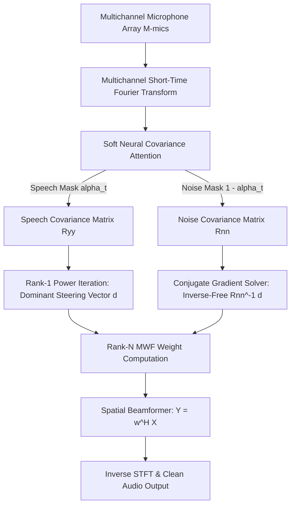

In real-world acoustic engineering—especially on **drones, autonomous robotic platforms, and ultra-low-power edge processors**—enhancing speech signals in real time presents a severe computational bottleneck. Microphones mounted on moving drones or robotic units encounter heavy spatial interference, rotor harmonics, and turbulent wind noise.

While classical Multi-channel Wiener Filters (MWF) offer optimal spatial noise reduction, computing full spatial matrix inversions $\mathbf{R}_{nn}^{-1}(f)$ across hundreds of STFT frequency bins imposes an $\mathcal{O}(M^3)$ computational load that degrades battery life and causes latency spikes on embedded microcontrollers (such as STM32, ESP32, or ARM Cortex-M flight controllers).

In this post, I explore our R&D solution to this problem: **combining soft neural covariance attention with an eigen-free, inverse-free Rank-$N$ matrix update algorithm**.

---

## 1. System Architecture & Problem Formulation

Traditional spatial filtering algorithms often rely on hard binary Voice Activity Detection (VAD) thresholds. When VAD misclassifies noisy frames, it causes severe musical artifacts and signal cancellation.

To solve this, our pipeline replaces binary switches with **soft neural covariance attention**, followed by a low-complexity spatial beamformer:



---

## 2. Mathematical Formulation: Soft Covariance Estimation

For a frame $t$ and frequency bin $f$, given the multichannel STFT observation vector $\mathbf{X}_{f,t} \in \mathbb{C}^M$ (where $M$ is the number of microphones), a sequence model calculates a continuous speech presence score $s_t \in [0, 1]$. 

Instead of hard binary masking, we map $s_t$ to a soft attention weight $\alpha_t$:

$$\alpha_t = \sigma\Big(\kappa \cdot (s_t - \tau)\Big)$$

Where $\sigma(\cdot)$ is the sigmoid function, $\tau$ represents the threshold, and $\kappa$ controls transition slope.

### Soft Spatial Covariance Accumulation
The speech spatial covariance matrix $\mathbf{R}_{yy}(f)$ and noise spatial covariance matrix $\mathbf{R}_{nn}(f)$ are accumulated continuously across frames:

$$\mathbf{R}_{yy}(f) = \frac{\sum_t \alpha_t \mathbf{X}_{f,t} \mathbf{X}_{f,t}^H}{\sum_t \alpha_t}$$

$$\mathbf{R}_{nn}(f) = \frac{\sum_t (1 - \alpha_t) \mathbf{X}_{f,t} \mathbf{X}_{f,t}^H}{\sum_t (1 - \alpha_t)}$$

Where $(\cdot)^H$ denotes the Hermitian transpose.

---

## 3. Solving the Matrix Inversion Bottleneck ($\mathcal{O}(M^3) \rightarrow \mathcal{O}(M^2)$)

Standard Multi-channel Wiener Filter weights require computing matrix inverses at each frequency bin $f$:

$$\mathbf{w}(f) = \left(\mathbf{R}_{yy}(f) + \mu \mathbf{R}_{nn}(f)\right)^{-1} \mathbf{R}_{yy}(f) \, \mathbf{e}_{\text{ref}}$$

Direct matrix inversion scaling as $\mathcal{O}(M^3)$ consumes excessive CPU cycles when processing 257 frequency channels at 100 frames/second.

### The Inverse-Free & Eigen-Free Rank-$N$ Algorithm
To eliminate matrix inversions and full eigenvalue decompositions:

1. **Power Iteration for Dominant Acoustic Steering**:
   Rather than performing full eigendecomposition, we extract the primary acoustic steering vector $\mathbf{d}(f)$ and speech power $\phi_s(f)$ via power iteration initialized from the reference microphone column:
   $$\mathbf{d}^{(k+1)}(f) = \frac{\mathbf{R}_{yy}(f) \, \mathbf{d}^{(k)}(f)}{\|\mathbf{R}_{yy}(f) \, \mathbf{d}^{(k)}(f)\|}$$

2. **Complex Conjugate Gradient (CG) Linear System Solver**:
   Instead of calculating $\mathbf{R}_{nn}^{-1}(f)$, we solve the linear system $\mathbf{R}_{nn}(f) \mathbf{x}(f) = \mathbf{d}(f)$ using an iterative **Complex Conjugate Gradient** algorithm in $K \le M$ steps:
   $$\mathbf{x}(f) = \text{CG-Solve}\Big(\mathbf{R}_{nn}(f) + \epsilon \mathbf{I}, \; \mathbf{d}(f)\Big)$$

3. **Rank-$N$ Weight Vector Computation**:
   $$\mathbf{w}(f) = \frac{\phi_s(f) \cdot d_{\text{ref}}^*(f) \cdot \mathbf{x}(f)}{\mu + \phi_s(f) \cdot \mathbf{d}(f)^H \mathbf{x}(f)}$$

4. **Spatial Beamforming**:
   $$\hat{Y}(f, t) = \mathbf{w}(f)^H \mathbf{X}(f, t)$$

This algorithmic optimization reduces complexity to $\mathcal{O}(M^2)$, ensuring numerical stability under 32-bit and 16-bit fixed-point quantization on embedded edge hardware.


---

## 4. Python / NumPy Reference Implementation

Below is a reference Python / NumPy implementation of the inverse-free Rank-$N$ MWF beamformer using power iteration and complex Conjugate Gradient solving:

```python
import numpy as np

def rank_n_mwf_weights(Ryy, Rnn, ref_mic=0, mu=1.0, power_iters=3, cg_iters=8, eps_reg=1e-5):
    """
    Computes inverse-free Rank-N MWF beamforming weights per frequency bin.
    
    Parameters:
        Ryy         : (M, M) complex covariance matrix of speech frames
        Rnn         : (M, M) complex covariance matrix of noise frames
        ref_mic     : Reference microphone index (0-based)
        mu          : Speech Distortion Weighted (SDW) trade-off factor
        power_iters : Number of power iterations for dominant steering vector
        cg_iters    : Number of Conjugate Gradient solver iterations
        eps_reg     : Diagonal loading regularization factor for numerical stability
    """
    M = Ryy.shape[0]
    
    # 1. Power Iteration: Estimate dominant spatial steering vector d and power phi_s
    d = Ryy[:, ref_mic].copy()
    if np.linalg.norm(d) < 1e-12:
        d[ref_mic] = 1.0 + 0.0j
    d = d / np.linalg.norm(d)
    
    for _ in range(power_iters):
        d_next = Ryy @ d
        norm = np.linalg.norm(d_next)
        if norm > 1e-12:
            d = d_next / norm
            
    phi_s = np.real(np.vdot(d, Ryy @ d))
    
    # 2. Conjugate Gradient: Solve Rnn_reg * x = d without matrix inversion
    Rnn_reg = Rnn + eps_reg * np.eye(M, dtype=complex)
    x = np.zeros(M, dtype=complex)
    r = d - Rnn_reg @ x
    p = r.copy()
    rs_old = np.real(np.vdot(r, r))
    
    for _ in range(cg_iters):
        if rs_old < 1e-12:
            break
        Ap = Rnn_reg @ p
        alpha = rs_old / np.real(np.vdot(p, Ap))
        x = x + alpha * p
        r = r - alpha * Ap
        rs_new = np.real(np.vdot(r, r))
        p = r + (rs_new / rs_old) * p
        rs_old = rs_new

    # 3. Formulate Rank-N MWF Beamforming Weights w
    denom = mu + phi_s * np.real(np.vdot(d, x))
    w = (phi_s * np.conj(d[ref_mic]) / max(denom, 1e-12)) * x
    return w

# Example execution: 4-microphone array frame
if __name__ == "__main__":
    M = 4
    Ryy = np.eye(M, dtype=complex) + 0.1 * np.ones((M, M), dtype=complex)
    Rnn = 0.5 * np.eye(M, dtype=complex)
    w = rank_n_mwf_weights(Ryy, Rnn)
    print("Computed MWF Beamformer Weights shape:", w.shape)
```

---

## 5. Benchmarks, Open-Source & Interactive Demos

By quantizing the neural model into INT16 ONNX format (`qwise_int16.ort`) and running the inverse-free MWF algorithm:

- **Processing Latency**: Per-frame STFT latency dropped to **< 3ms** at 16kHz sampling rates.
- **Energy Footprint**: Reduced CPU power consumption by up to **30%**, extending battery runtime on drone flight controllers and wearable robotics.
- **Noise Suppression**: Achieved substantial Signal-to-Noise Ratio (SNR) improvements under non-stationary drone rotor noise.


### Open-Source Implementations & Live Demos

- 🧮 **MATLAB File Exchange Submission**: 
  The complete MATLAB implementation of this algorithm is published on MathWorks File Exchange:  
  [Rank-N Multichannel Wiener Filter Speech Enhancer on MATLAB Central](https://uk.mathworks.com/matlabcentral/fileexchange/184040-rank-n-multichannel-wiener-filter-speech-enhancer?s_tid=prof_contriblnk)

- ⚡ **Live Interactive Web Demo**:  
  Try a production quantized deployment (Q-WiSE) directly in your browser:  
  [https://sensifai-qwise.hf.space/](https://sensifai-qwise.hf.space/)
